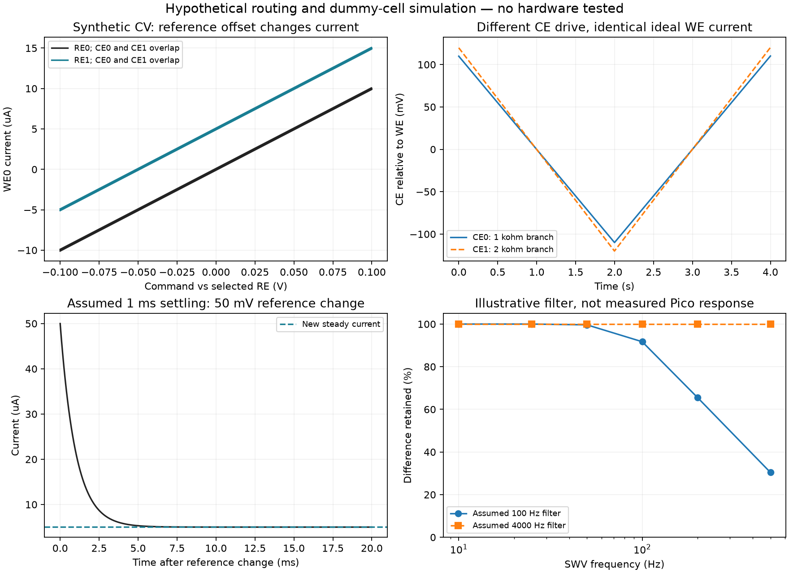

> **Withdrawn from normal execution (2026-09-14):** The queue-level reversed-bipot option was removed because it changes method settings and does not establish transparent physical CE/RE switching. Normal queue, runner and session code were restored to their pre-experiment versions. Instructions below describing an enabled queue option are historical and must not be followed. Live evidence remains bounded CA only. The requested unchanged-method, unchanged-wiring switch is unresolved.

# EmStat Pico electrode routing with the WE0 multiplexer

Subsequent hardware testing is recorded in the [live flow-cell test report](live-test.md): configuration accepted, first reversed-bipot measurement overloaded, default route restored. The simulations below remain offline models.

**The requested routing has a credible silicon-level basis. It is not established as an available feature of stock EmStat Pico firmware.** Reversing the bipotentiostat roles is a worthwhile, specific experiment for WE0 + RE1 + CE1. It does not independently select RE and CE, and its compatibility with this Pico remains unverified. Describing all cross-routing as physically impossible would be unjustified.

This assessment concerns physical Pico terminals, indexed from zero. External MUX positions are numbered 1–16. Some manufacturer brochures instead call the first and second potentiostat channels “1” and “2”; those are not the RE1/CE1 terminal names used here. No instrument measurements, firmware modifications, or application changes are part of the accompanying simulation.

The requested combinations have the following status. “Candidate” means an electrical route or operating hypothesis to validate, not a runnable, supported Pico configuration. Supporting evidence follows the table.

| Physical terminals; existing WE0 MUX retained | Stock Pico, ordinary channel selection | Reversed bipot hypothesis | ADuCM355 high-speed routing candidate | Practical status |
|---|---|---|---|---|
| WE0 + RE0 + CE0 | Existing application configuration | Unnecessary | Baseline | Available in current software |
| WE0 + RE1 + CE1 | Selecting channel 1 alone is insufficient | Main 1; WE0 secondary, following at zero offset | Separate drive/feedback selection | Best software-only hypothesis; unverified |
| WE0 + RE1 + CE0 | No documented independent selector found | Does not provide this split | Separate drive/feedback selection | Requires a supported firmware extension or another routing mechanism |
| WE0 + RE0 + CE1 | No documented independent selector found | Does not provide this split | Separate drive/feedback selection | Requires a supported firmware extension or another routing mechanism |

**Current application behavior.** `core/swv_method.py:157` disables channel 1, selects channel 0, and selects high-speed mode 3. `core/bo_session.py:3976` calculates the external MUX address as `(idx << 4) | idx`; this chooses matching external WE and RE/CE positions. Neither operation is an independent physical Pico reference/counter selector. Low-speed builders elsewhere use mode 2. Changing only the selected potentiostat channel would also change which working-electrode current is the primary measurement.

**Confirmed MethodSCRIPT and SDK behavior.** The manual specifies whole-channel selection, modes 0/off, 2/low speed, 3/high speed and 4/max range. For Pico, `set_bipot_mode` configures the non-active channel; it requires cell-off and resets that channel's settings. Fixed and offset behavior differ. Offset follows the main WE. `add_meas` records an additional current; `bb` identifies bipot current. Legacy `poly_we` uses the main channel's reference/counter. These establish the ingredients for investigating reversed roles, but no explicit Pico example proving main=1 with secondary=0 was found. [1: MethodSCRIPT §§9.1–9.2, 12.5, 14.16.3–14.16.8](https://dev.palmsens.com/methodscript/latest/methodscript/methodscript_main.html)

The SDK documents `ExtraValueMsk`, `BipotModePS`, `BiPotPotential`, and technique capability flags. Its multiplexer settings concern external MUX operation. No independent physical RE/CE routing property was found in the reviewed SDK technique documentation. Switching from serial commands to the SDK therefore does not establish an additional route. [2: PalmSens SDK, “Recording extra values” and “Multiplexer”](https://sdk.palmsens.com/wpf/latest/files.html)

**Underlying electrical paths.** On the ADuCM355, the following high-speed paths are documented. These are silicon switches, not MethodSCRIPT commands or Pico register IDs.

| Function | Silicon path | UG-1262 Rev. C location |
|---|---|---|
| Counter drive | Excitation output D → D5 → CE0; alternatively D6 → CE1 | p.119, Table 145 |
| Reference feedback | RE0 → P5 → excitation P; alternatively RE1 → P6 | pp.121–122, Table 147 |
| WE0-side voltage sense candidate | SE0 → N9 → excitation N | p.120, Table 146 |
| WE0-side current candidate | SE0 → RLOAD02 → T5 → T9 → high-speed TIA → ADC | pp.122–123, Table 148; p.152 |
| Alternate current entry | DE0 → T10 → high-speed TIA; T9 open | p.122, Table 148 |

`SWCON` is at `0x400C200C`; `DSWFULLCON`, `NSWFULLCON`, `PSWFULLCON`, `TSWFULLCON` are at `0x400C2150/54/58/5C`. Bit 16 selects full control; status registers are `DSWSTA/PSWSTA/NSWSTA/TSWSTA`. Low-power amplifier switches must also be configured. Figures 16–17 show separate low-power loops; Figure 27 shows high-speed routing. [3: ADI UG-1262, pp.83–84, 114–125, 152](https://www.analog.com/media/en/technical-documentation/user-guides/aducm355-hardware-reference-manual-ug-1262.pdf)

**Engineering inference:** holding the current/sense path constant while selecting D and P independently supplies candidates for all four combinations. This is a connectivity argument, not proof of loop stability, common-mode headroom, calibration, or accessibility on Pico. No complete board-specific register image is proposed: that would require the module netlist, its existing amplifier configuration, and verified switch timing.

**What the module and MUX expose.** Pico's published pin table assigns physical RE0/WE0/CE0 to pins 16/17/18 and CE1/WE1/RE1 to 12/13/14. PalmSens confirms AD8606 buffers on the reference inputs. It also distinguishes two low-speed DACs from a single high-speed DAC; combined operation is available on one channel at a time. The module-level route therefore includes reference buffers, not just bare ADuCM355 pins. [4: Pico specifications, pin table and “Analog interface”](https://dev.palmsens.com/espico/espico_specs.html)

The supplied MUX schematic connects `PICO_WE_0` to IC5's WE selector and `PICO_RE_0`/`PICO_CE_0` to IC4's two selector banks. IC4 shares one address for RE and CE. CON6 exposes both physical triples; physical channel 1 does not feed these MUX banks. The filename says V3, but the drawing title block says V1, dated 18/08/2022. It is a carrier schematic, not a full internal Pico module schematic. [5: EmStat Pico MUX16 schematic, sheet 1, IC4/IC5/CON6](https://assets.palmsens.com/app/uploads/2021/06/EmStat-Pico-MUX16-Schematics_V3.pdf)

The complete module-level route cannot yet be certified: the exact WE0 connection to the silicon's sense/diagnostic branches, any revision-specific components, and the installed wiring need verification. The public specifications make cross-routing plausible; they do not replace that missing connectivity check. In particular, the presence of a connector labelled SWD on a carrier drawing does not establish an accessible, unlocked debug connection to the Pico CPU.

**Low speed, high speed, max range, and bipot.** PalmSens specifies bipot operation in low-speed mode, excluding EIS and OCP. It describes low speed as up to 1 V/s or 100 Hz bandwidth, with 100 points/s versus high speed's 1000 points/s. Max range combines low/high-speed operation. Its standard bipot arrangement shares the first channel's RE/CE and supports fixed or offset secondary potential; its potential-span-plus-offset constraint is below 1.6 V. The second physical WE has a typical 110-ohm uncompensated series resistance, so symmetry should not be assumed. [6: EmStat Pico brochure, pp.4–5, revision 01-2026-021](https://assets.palmsens.com/app/uploads/2026/02/EmStat-Pico-Brochure.pdf)

| Mode / proposal | Consequence for this investigation |
|---|---|
| Low-speed ordinary operation | Native paired loops do not themselves establish arbitrary reference/counter mixing. |
| High-speed silicon switch proposal | Most direct candidate for independent drive/feedback selection; existing Pico high-speed operation still owns those switches. |
| Max-range proposal | Must verify both waveform-generation contributions and every configuration transition. A switch change tested in one operating state is insufficient. |
| Standard bipot | Useful control experiment for shared-reference behavior, but uses the wrong physical reference/counter pair for the requested alternative. |
| Reversed bipot | Potential route to the complete RE1/CE1 pair; separate WE0 current must be acquired. Mixed pairs remain unsolved. |

A bandwidth limit is not the same thing as a guaranteed maximum SWV frequency. Pulse settling, acquisition windows, current range, and the extra measurement all matter. A low-speed workaround would require new technique validation; it cannot silently replace the current mode-3 SWV. The specifications also show that available bandwidth depends on current range. [4: Pico specifications, electrical-characteristics table](https://dev.palmsens.com/espico/espico_specs.html)

**Manufacturer answers and reversed roles.** An actual ADI employee answer by Akila on 19 January 2024 confirms measurement with CE0/RE0/SE0 and CE0/RE0/SE1 and points to `M355_ECSns_DualWE`. That confirms shared-reference dual-WE operation on ADuCM355. It does not confirm the reverse arrangement on stock Pico, nor independently mixed RE/CE. [7: ADI EngineerZone, “Sharing SE0/SE1 for 2-Channel Measurements,” employee response](https://ez.analog.com/microcontrollers/precision-microcontrollers/f/q-a/577132/sharing-se0-se1-for-2-channel-measurements/515673)

The corresponding ADI example initializes both low-power TIAs, powers the channel-0 potentiostat amplifier, and powers down the channel-1 potentiostat amplifier/DAC. It measures both current paths. This is useful firmware-level precedent, but the example is amperometric and explicitly configured in the standard direction. Swapping one channel index in it would not establish a calibrated Pico CV/SWV implementation. [8: ADI `Amperometric.c`, `AppECSnrInit`, `AppADCInit`, `AppM355SeqMeasureGen`](https://github.com/analogdevicesinc/aducm355-examples/blob/master/examples/ApplicationExamples/M355_ECSns_DualWE/Amperometric.c)

The reversed-role hypothesis is specific: use channel 1's control loop with RE1/CE1, retain the chip on WE0, configure WE0 as the secondary WE with zero tracking offset, and record that secondary current. The unresolved questions are whether Pico firmware allows that direction, whether it truly uses RE1/CE1, whether an unloaded WE1 is allowed, and whether the secondary follows every SWV pulse with correct sampling. A nonzero current in the main output stream answers none of those questions. A test with a separate, distinguishable dummy load on WE1 is better than interpreting an empty input.

**Register access and stock firmware.** The Pico protocol's `S`/`G` commands address instrument configuration registers with two-hex-digit IDs. Chapter 5 lists configuration, calibration, and identification registers; it does not expose the four ADuCM355 switch-register addresses above. Advanced permission unlocks listed user settings, not a documented arbitrary AFE memory writer. The firmware query is `t` (§4.1). No supported raw AFE-write interface was found in the reviewed protocol. [9: Pico communication protocol, §§4.1–4.3, 5, 6.2](https://dev.palmsens.com/comm_espico/latest/comm/comm_main.html)

The generic error table's MCU-access error is not enough to establish that all AFE registers are inaccessible: its wording distinguishes MCU registers from peripherals. Conversely, the error's existence does not establish a usable write command. No command should be invented from that error code. [1: MethodSCRIPT, error 0x004A](https://dev.palmsens.com/methodscript/latest/methodscript/methodscript_main.html)

The practical stock-firmware conclusion is therefore **no documented independent selector found**, with reversed bipot still worth testing. There is no PalmSens answer in the reviewed sources specifically authorizing these mixed physical-terminal combinations. Public manuals cannot exclude a private OEM interface or manufacturer firmware change.

**Custom firmware scope.** A manufacturer-supported routing extension is preferable to replacing the firmware. The proposed request is a routing operation that preserves the WE0 measurement path, disables competing drivers, selects feedback and counter drive independently, and reapplies the route whenever a technique or range reconfigures the AFE. It should return the effective route and reject unsupported combinations.

A custom ADuCM355 firmware project would need a confirmed programming/recovery path, a board-specific analog driver, waveform generation, timing, ADC/TIA conversion, range changes, calibration handling, overload detection, and a host protocol. It is not a host-side setting. CV and SWV remain mathematically implementable, but existing MethodSCRIPT files are not automatically compatible with replacement firmware. Reimplementing their behavior would need explicit comparison against stock operation. Existing calibration coefficients must not be assumed correct for altered paths; verify gain, offset, bias, range transitions, noise, and response versus frequency. Recovery and calibration preservation should be agreed with PalmSens before any flashing experiment.

**Offline experiments and results.** The accompanying [Python simulation](simulate_routing.py) is a numerical dummy-cell thought experiment. It assumes the requested routing works, and tests what different successful routes would look like. It neither parses MethodSCRIPT nor emulates Pico firmware, so no result is evidence that a hardware command is supported.

The CV model uses a 10-kilohm resistor in parallel with 1 microfarad, a -100 to +100 mV triangular command at 100 mV/s, hypothetical reference offsets of 0/50 mV, and counter branches of 1/2 kilohms. It assumes ideal control with sufficient headroom. Current is `I = E_effective/R + C*dE_effective/dt`. Voltage zero is an arbitrary local WE reference, not Pico AGND. The capacitive term reverses at the triangular-wave vertex; this is expected for this ideal RC model.

| Experiment | Numerical result | What it establishes |
|---|---|---|
| Four hypothetical complete CV runs | Changing CE alone gives identical WE0 current; CE drive differs | Current similarity cannot identify the selected CE |
| Change reference offset by +50 mV | Steady current changes by +5 microamps | Reference identity matters even with identical command limits |
| Conditional reversed bipot with distinguishable 20-kilohm main load | WE0 secondary matches its 10-kilohm baseline; WE1 primary is different | Selecting the correct recorded stream is necessary; firmware support is still an assumption |
| Reference change at a held command; assumed 1 ms settling | Initial current about 50 microamps, settling toward 5; capacitive charge about 50 nC | Switching during acquisition can create a feature unrelated to a chemical peak |
| Resistive SWV through an illustrative first-order 100 Hz filter | At 200 Hz SWV, 65.6% of ideal end-pulse difference remains | Bandwidth changes can change the result despite correct routing |

The SWV submodel uses a +/-25 mV square wave with end-half-cycle sampling; its filter is analyst-selected, not a measured Pico transfer function. The exact retained fraction is `tanh(pi * bandwidth / (2 * frequency))`. A 4000 Hz comparison filter has essentially full response at 200 Hz in this model. This comparison must not be used as a correction factor for experimental data. Electrochemical kinetics, diffusion, noise, firmware acquisition, saturation, electrode degradation and actual reference drift are not simulated.

Analytical checks passed for CE-current invariance, the 5-microamp reference shift, conditional secondary-current equality, transient-charge integration, filter bounds, and the assumed modest CE drive. Outputs: [CV data](cv.csv), [bipot streams](bipot_streams.csv), [switch transient](reference_switch.csv), [SWV filter data](swv_filter.csv), [machine-readable summary](simulation_summary.json), and [figure](simulation.png). CSV files are the spreadsheet-readable backing data for the plots.

**Switching timing.** Between complete scans, use a defined sequence: finish acquisition, turn the cell off, change the supported route, initialize all required settings, equilibrate at the next scan's starting condition, then begin a new trace. Save the selected route and actual transition time with every trace. Preserve the old route as the default when loading old recipes. Settling time must be measured on the intended cell; the simulation's 1 ms is not a recommendation.

Switching within an active scan is a separate experimental technique. Stock bipot mode cannot be changed with the cell on. A custom switch operation could physically change the circuit mid-scan, but reference steps, capacitive charging, temporary loss of feedback, filter memory and sample-window overlap can contaminate the result. It would require synchronized switching, acquisition blanking, and separate data segments. A smooth joined CV would conceal the intervention. [1: MethodSCRIPT §14.16.3](https://dev.palmsens.com/methodscript/latest/methodscript/methodscript_main.html)

**Smallest external alternative if internal routing is unavailable.** Keep the existing WE0 MUX and use two independently controlled break-before-make SPDT signal switches: one connects Pico RE0 to reference electrode A or B; the other connects Pico CE0 to counter electrode A or B. A single mechanically linked DPDT only chooses complete pairs and cannot provide all four combinations. Low-leakage signal/reed relays are candidates, with ratings and leakage chosen for the actual cell. No specific part has been qualified here.

This changes the wiring: the alternative electrodes plug into the selector harness, not into active Pico RE1/CE1 outputs/inputs. The switches do not join CE0 to CE1 or WE0 to WE1. Thus it meets automatic electrode selection, but does not prove or retain literal internal routing through the physical “1” terminals. If keeping those exact terminal connections is non-negotiable, this alternative does not meet the requirement.

The carrier drawing uses GPIO0–7 and the two I2C-labelled pins for MUX address/enables. A relay controller should not assume those pins are spare; a separate USB controller is an option to evaluate. Existing external RE/CE MUX positions could select paired electrode alternatives only after suitable rewiring; their common address prevents arbitrary independent RE/CE selection by that single bank. [5: MUX schematic, IC4/IC5 control nets](https://assets.palmsens.com/app/uploads/2021/06/EmStat-Pico-MUX16-Schematics_V3.pdf)

**Information still needed.** Record the exact firmware response and supported MethodSCRIPT version, module serial/revision, carrier-board revision, and a top/bottom photo with readable connector labels. Record which connector receives each CE/RE lead, every splitter/jumper, the MUX position mapping, and whether electrode alternatives are separate electrodes or electrically shared leads. A power-off wiring continuity map should distinguish harness connections from paths through powered electronics. Obtain the module's WE0-to-SE0/DE0 mapping and reference-buffer routing from PalmSens; carrier photos alone may not reveal it.

The precise manufacturer questions are: Does the installed firmware support main channel 1 with physical WE0 as the secondary in CV and SWV? Does it use physical RE1/CE1, including with WE1 unloaded? Which secondary current field is valid? Can D/P routing be exposed while preserving WE0, including mixed pairs? Are there supported AFE read/write commands, and which technique operations overwrite the switches? What calibration/recovery procedures apply? These questions are prepared for review; no message has been sent on the laboratory's behalf.

Primary sources were reviewed on 14 September 2026. Live “latest” documentation can change and does not identify the installed firmware. Source locations and document revisions are given beside the relevant findings; the four user-supplied PalmSens sources and ADI hardware manual are all included above. The modern Pico bipot commands require MethodSCRIPT 1.7 or newer; an older device needs version-appropriate investigation. [1: MethodSCRIPT §14.16.3](https://dev.palmsens.com/methodscript/latest/methodscript/methodscript_main.html)

**Practical recommendation and dummy-cell validation plan.** First investigate reversed bipot for the complete RE1/CE1 pair on a resistor fixture. It is a smaller intervention than custom firmware. Keep high-speed SWV unchanged until that approach is proven and its timing limits are understood. For all four independent combinations, pursue a PalmSens-supported internal route; if unavailable, the two-switch external harness is the most contained fallback.

1. Remove the sensor chip from the test circuit and use a documented dummy fixture. Save instrument identity, firmware, original scripts, and raw packets. Keep the normal application disconnected so only one controller owns the serial port.
2. Fix one WE0 MUX position. Connect a 10-kilohm WE0-to-solution-node resistor; connect RE0 to that node and CE0 through a separate 1-kilohm counter branch. Run the existing supported route at small potentials, initially +/-50 mV with slow stepping. Expect about +/-5 microamps after settling, within resistor and instrument tolerances. Confirm polarity by the measured baseline.
3. Add an independently identifiable WE1 dummy branch, such as 20 kilohms to the same solution node, for the standard supported bipot control. Record both currents and verify that changing the WE0 resistor changes the WE0 stream, not the identity of the main stream. Do not tie the two WE inputs together.
4. After confirming the firmware-specific syntax/capabilities, test main=1 and secondary=0 with cell-off configuration and conservative low-speed acquisition. Connect CE1 through a separately sensed counter resistor. If the firmware rejects the setup, record the exact error and stop that candidate. Acceptance alone is insufficient: repeat the load-identification test.
5. Identify the counter path by measuring current through each distinct CE branch, using isolated differential sensing. The selected branch should carry the summed WE return current; the unselected branch should carry only residual leakage. Never short two counter outputs or attach a grounded scope clip to a driven electrode.
6. Identify the reference path separately. Use a designed, isolated small reference-offset fixture, for example 10 mV relative to the solution node with known impedance and valid common-mode range. Perturb one reference at a time. A 10-kilohm resistive cell should show roughly a 1-microamp magnitude change only when that reference controls it. Measure the applied WE-to-selected-RE voltage independently. Do not infer selection from two nominally similar reference electrodes in buffer.
7. If an internal independent-routing extension becomes available, repeat that identification for every table row while keeping WE0 fixed. Confirm the expected active CE, responsive RE, and WE0 current stream separately. Restore the baseline between candidates to detect residual configuration changes.
8. Add a known capacitor and compare slow CV and low-frequency SWV against baseline. Increase SWV frequency gradually only within the supported mode's timing limits. Save pulse-resolved/raw output where available, reject overload/timing errors, and compare measured potential as well as current. Establish tolerances from fixture accuracy, instrument specifications and repeated baseline variability rather than a convenient arbitrary percentage.
9. Finally repeat cell-off route changes between complete scans, including A/B/A repeatability, abort, reconnect, and restart. Verify settings do not revert when techniques/ranges change. Only after these checks should the sensor in buffer be tested, followed by any method-creation UI or queue integration.
